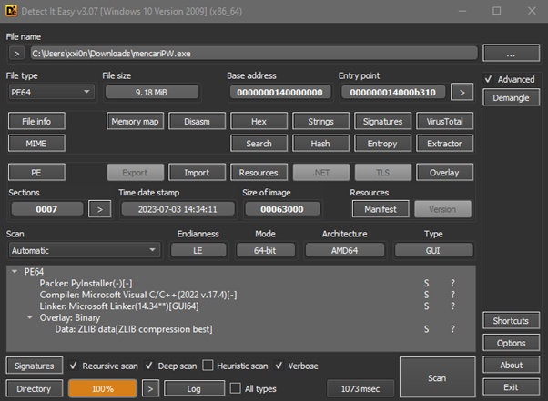
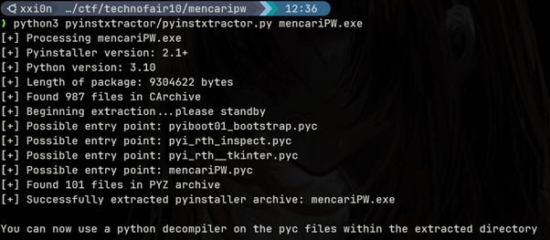

## Reverse Engineering
## writeup_dundorma

# Chall
- Description
    - mister falatehan mendapatkan file login form dari mas joni bantu mister agar bisa login pada file tsb
- Author
    - rincember

# Solving Steps
- Identifying the challenge
    - Dari attachment yang diberikan, kita bisa menggunakan software *detect it easy* untuk mencari tahu apa packer maupun compiler yang digunakan untuk mengcompile sebua executable.
    
- Decompiling the executable
    - Setelah diketahui bahwa file tersebut adalah executable kode python yang di compile menggunakan packer PyInstaller. Kita dapat langsung mengextract pyinstaller archive menggunakan [PyInstaller Extractor](https://github.com/extremecoders-re/pyinstxtractor)
    
    - Kemudian kita bisa langsung mendecompile mencariPW.pyc menggunakan [pycdc](https://github.com/zrax/pycdc)
- Analyzing the decompiled executable
    - Running the [pycdc](https://github.com/zrax/pycdc) we get
```py
# Source Generated with Decompyle++
# File: mencariPW.pyc (Python 3.10)


import tkinter
import string
from tkinter import messagebox
window = tkinter.Tk()
window.title('Login form')
window.geometry('340x440')
window.configure('#333333', **('bg',))


def login():
Warning: block stack is not empty!
    username = 'TechnoFairCTF'
    password = [
        'qswaefrdthy_gukojplzcxvbmn',
        'pkolihu_jyftgrsedwaqmzbxvc',
        'mlnkbjvhcgxfzdsapqowueyr_t',
        'plokijuhygtfrdeswaqmnbvcxz',
        'qswdefrgthyjukilopmnbzvcx_',
        'qswaefrgthyjukilpom_znxbcv',
        'zqwsedrftgyhuji_kolpxcvbnm',
        'qaedwsrf_tgujyhikpomznxbcv',
        'mxnzbcvqsplokwdij_efuhrgyt',
        'plokmnzbxvcijuygtfrdeswa_q',
        'plmoknijbuhvygctfxrdzeswaq',
        'qazwsxedcrfvtgbyhnujmikol_',
        'wqzsxedcrfvt_gbyhnujmikolp',
        'qazwxedcrf_vtgbyhnplmokiju',
        'okmplijnuhbygvtfcrdxewqaz_',
        'ygvtfcrd_xeszqaplmoknijbuh',
        'ijnkmpluhbygvtfc_rdxeszwqa',
        'tyuioplkjhgfdsaqwezxcvb_nm',
        'mkolpijnuhbygv_tfcrxeszwaq',
        'hubijnmkoplygvtfcrdxeszwaq',
        'swxedcr_fvtgbynujmikolpqaz',
        'trqwyuioplkjhgfdsazxcvbn_m',
        'klopmijn_ubygvtfcrdxeszaqw',
        'bvnmczxlaksjdhfgp_qowiruty']
    entered_username = username_entry.get()
    entered_password = password_entry.get()
    if entered_username != username:
        messagebox.showerror('Error', 'Invalid Login', **('title', 'message'))
        return None
    if None(entered_password) < 8 and len(entered_password) < 24 or len(entered_password) > 24:
        messagebox.showerror('Error', 'Password di antara 1 sampai 24 karakter.', **('title', 'message'))
        return None
    for char, pw_string in None(entered_password, password):
        if char in pw_string or char not in string.ascii_lowercase + '_':
            messagebox.showerror('Error', 'masih salah, coba lagi bestie', **('title', 'message'))
            return None
        messagebox.showinfo('Login Success', 'GG gaming abang heker \nTechnoFairCTF{%s}' % entered_password, **('title', 'message'))
        return None


frame = tkinter.Frame('#333333', **('bg',))
login_label = tkinter.Label(frame, 'Login', '#333333', '#FF3399', ('Arial', 30), **('text', 'bg', 'fg', 'font'))
username_label = tkinter.Label(frame, 'Username', '#333333', '#FFFFFF', ('Arial', 16), **('text', 'bg', 'fg', 'font'))
username_entry = tkinter.Entry(frame, ('Arial', 16), **('font',))
password_entry = tkinter.Entry(frame, '*', ('Arial', 16), **('show', 'font'))
password_label = tkinter.Label(frame, 'Password', '#333333', '#FFFFFF', ('Arial', 16), **('text', 'bg', 'fg', 'font'))
login_button = tkinter.Button(frame, 'Login', '#FF3399', '#FFFFFF', ('Arial', 16), login, **('text', 'bg', 'fg', 'font', 'command'))
login_label.grid(0, 0, 2, 'news', 40, **('row', 'column', 'columnspan', 'sticky', 'pady'))
username_label.grid(1, 0, **('row', 'column'))
username_entry.grid(1, 1, 20, **('row', 'column', 'pady'))
password_label.grid(2, 0, **('row', 'column'))
password_entry.grid(2, 1, 20, **('row', 'column', 'pady'))
login_button.grid(3, 0, 2, 30, **('row', 'column', 'columnspan', 'pady'))
frame.pack()
window.mainloop()
```
    - Dari kode berikut kita bisa lihat bahwa username credentials login adalah TechnoFairCTF dan password nya disusun dari array password. Bisa dilihat item dari array password berisi semua alphabet, sehingga kita bisa simpulkan bahwa string password adalah alphabet yang tidak ada pada item array password, dan jika semua alphabet ada di item tersebut, karakter password adalah “_”. Langsung saja kita buat solver nya.
```py
import string
password = [
    'qswaefrdthy_gukojplzcxvbmn',
    'pkolihu_jyftgrsedwaqmzbxvc',
    'mlnkbjvhcgxfzdsapqowueyr_t',
    'plokijuhygtfrdeswaqmnbvcxz',
    'qswdefrgthyjukilopmnbzvcx_',
    'qswaefrgthyjukilpom_znxbcv',
    'zqwsedrftgyhuji_kolpxcvbnm',
    'qaedwsrf_tgujyhikpomznxbcv',
    'mxnzbcvqsplokwdij_efuhrgyt',
    'plokmnzbxvcijuygtfrdeswa_q',
    'plmoknijbuhvygctfxrdzeswaq',
    'qazwsxedcrfvtgbyhnujmikol_',
    'wqzsxedcrfvt_gbyhnujmikolp',
    'qazwxedcrf_vtgbyhnplmokiju',
    'okmplijnuhbygvtfcrdxewqaz_',
    'ygvtfcrd_xeszqaplmoknijbuh',
    'ijnkmpluhbygvtfc_rdxeszwqa',
    'tyuioplkjhgfdsaqwezxcvb_nm',
    'mkolpijnuhbygv_tfcrxeszwaq',
    'hubijnmkoplygvtfcrdxeszwaq',
    'swxedcr_fvtgbynujmikolpqaz',
    'trqwyuioplkjhgfdsazxcvbn_m',
    'klopmijn_ubygvtfcrdxeszaqw',
    'bvnmczxlaksjdhfgp_qowiruty']

alphabet = string.ascii_lowercase
rlpassword = ""
for i in password:
  if not i.__contains__("_"):
    rlpassword += '_'
  for j in alphabet:
    if not i.__contains__(j):
      rlpassword += j
   
print(f"Password: {rlpassword}")
print("Flag: TechnoFairCTF{" + rlpassword + "}")
```
# Flag
**TechnoFairCTF{ini_adalah_password}**
